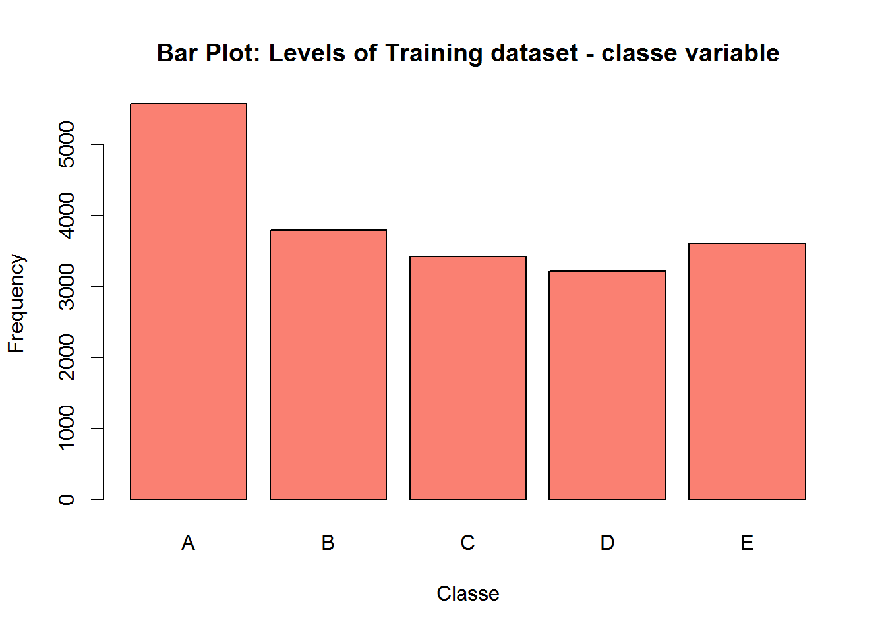
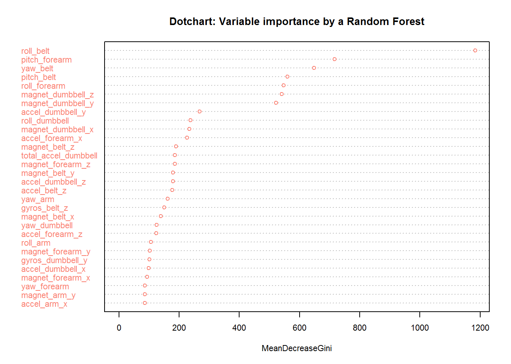

# Prediction Assignment Writeup
msuppo  
Monday, April 25, 2016  

##Background

Using devices such as Jawbone Up, Nike FuelBand, and Fitbit it is now possible to collect a large amount of data about personal activity relatively inexpensively. These type of devices are part of the quantified self movement - a group of enthusiasts who take measurements about themselves regularly to improve their health, to find patterns in their behavior, or because they are tech geeks.

One thing that people regularly do is quantify how much of a particular activity they do, but they rarely quantify how well they do it. In this project, we will use data recorded from accelerometers on the belt, forearm, arm, and dumbbell of 6 participants. They were asked to perform barbell lifts correctly and incorrectly in 5 different ways.

More information is available from the website http://groupware.les.inf.puc-rio.br/har (see the section on the Weight Lifting Exercise Dataset).

The goal of this project is to predict the manner in which the volunteers did the exercise. The outcome is measured against 60 observations and classifed as "A,B,C,D,E" catogerise and it is stored in the classe variable in the data set.

This assignment will: 

1. create a report describing how the model is built
2. how cross validation is use
3. what is the expected out of sample error and why the choices were made
4. use prediction model to predict 20 different test cases 

##Data Loading and Cleaning 

The data for this assignment was obtained from http://groupware.les.inf.puc-rio.br/har  
Two data set were available: training data and testing data. 

Excluding variables with at least one "NA" and variables with nearly zero variance. Predictor Candidates: Belt, arm, dumbbell and forearm variables do not have any missing values in the test dataset. Then, Subset the Training dataset to include only the predictor candidates and the outcome variable: classe. Make classe into a factor. Split the dataset into a 60% training and 40% for cross-validation dataset.


```r
library(caret)
library(rpart)
library(rpart.plot)
library(randomForest)
require(data.table)
```

```r
setwd("C:/Users/usuariodell/Desktop/DS/R ejercicios")

setInternet2(TRUE)
urlTrain <- "https://d396qusza40orc.cloudfront.net/predmachlearn/pml-training.csv"
Data <- fread(urlTrain)
urlTest <- "https://d396qusza40orc.cloudfront.net/predmachlearn/pml-testing.csv"
DataTest <- fread(urlTest)
hayMissing <- sapply(DataTest, function (x) any(is.na(x) | x == ""))
esPredictor <- !hayMissing & grepl("belt|[^(fore)]arm|dumbbell|forearm", names(hayMissing))
pCandidatos <- names(hayMissing)[esPredictor]
pCandidatos
```

```
##  [1] "roll_belt"            "pitch_belt"           "yaw_belt"            
##  [4] "total_accel_belt"     "gyros_belt_x"         "gyros_belt_y"        
##  [7] "gyros_belt_z"         "accel_belt_x"         "accel_belt_y"        
## [10] "accel_belt_z"         "magnet_belt_x"        "magnet_belt_y"       
## [13] "magnet_belt_z"        "roll_arm"             "pitch_arm"           
## [16] "yaw_arm"              "total_accel_arm"      "gyros_arm_x"         
## [19] "gyros_arm_y"          "gyros_arm_z"          "accel_arm_x"         
## [22] "accel_arm_y"          "accel_arm_z"          "magnet_arm_x"        
## [25] "magnet_arm_y"         "magnet_arm_z"         "roll_dumbbell"       
## [28] "pitch_dumbbell"       "yaw_dumbbell"         "total_accel_dumbbell"
## [31] "gyros_dumbbell_x"     "gyros_dumbbell_y"     "gyros_dumbbell_z"    
## [34] "accel_dumbbell_x"     "accel_dumbbell_y"     "accel_dumbbell_z"    
## [37] "magnet_dumbbell_x"    "magnet_dumbbell_y"    "magnet_dumbbell_z"   
## [40] "roll_forearm"         "pitch_forearm"        "yaw_forearm"         
## [43] "total_accel_forearm"  "gyros_forearm_x"      "gyros_forearm_y"     
## [46] "gyros_forearm_z"      "accel_forearm_x"      "accel_forearm_y"     
## [49] "accel_forearm_z"      "magnet_forearm_x"     "magnet_forearm_y"    
## [52] "magnet_forearm_z"
```

```r
varCandidatos <- c("classe", pCandidatos)
Data <- Data[, varCandidatos, with=FALSE]
dim(Data)
```

```
## [1] 19622    53
```

```r
Data <- Data[, classe := factor(Data[, classe])]
Data[, .N, classe]
```

```
##    classe    N
## 1:      A 5580
## 2:      B 3797
## 3:      C 3422
## 4:      D 3216
## 5:      E 3607
```

```r
plot(Data$classe, col="salmon", main="Bar Plot: Levels of Training dataset - classe variable", xlab="Classe", ylab="Frequency")
```



## Splitting the Data (training and testing) for cross validation.

The resulted Data is Partitioned to obtain a 70% training set and a 30% test set, in order to generate a test set for cross validation independent from the 20 cases provided set. Preprocessing the prediction variables by centering and scaling. Then, applying the centering and scaling to the testing dataset.


```r
set.seed(16369)
Training <- createDataPartition(Data$classe, p=0.7)
DatosTrain <- Data[Training[[1]]]
DatosProbe <- Data[-Training[[1]]]
Pto <- DatosTrain[, pCandidatos, with=FALSE]
preProc <- preProcess(Pto)
PtoN <- predict(preProc, Pto)
DatosTrainN <- data.table(data.frame(classe = DatosTrain[, classe], PtoN))
Pto <- DatosProbe[, pCandidatos, with=FALSE]
PtoN <- predict(preProc, Pto)
DatosProbeN <- data.table(data.frame(classe = DatosProbe[, classe], PtoN))
```

##Fitting and Training the Predicion Model

Method used: Random Forest. Random forests build lots of bushy trees, and then average them to reduce the variance. I choose this method because normally have a very hight accuracy. Using this method, the out of sample error should be very small (3% or less). If that is the case, Random Forest would be a very good option for Prediction. The error will be estimated using the 30% testing sample. 


```r
methodo <- "rf"
if (file.exists("TModelo.RData")) {
  load("TModelo.RData") 
  } else 
    TModelo <- train(classe ~ ., data=DatosTrainN, method=methodo)
```

##Evaluating the model on the Training dataset

```r
TModelo
```

```
## Random Forest 
## 
## 11776 samples
##    52 predictor
##     5 classes: 'A', 'B', 'C', 'D', 'E' 
## 
## No pre-processing
## Resampling: Bootstrapped (25 reps) 
## Summary of sample sizes: 11776, 11776, 11776, 11776, 11776, 11776, ... 
## Resampling results across tuning parameters:
## 
##   mtry  Accuracy   Kappa    
##    2    0.9855616  0.9817363
##   27    0.9873375  0.9839843
##   52    0.9774073  0.9714210
## 
## Accuracy was used to select the optimal model using  the largest value.
## The final value used for the model was mtry = 27.
```

```r
h <- predict(TModelo, DatosTrainN)
confusionMatrix(h, DatosTrain[, classe])
```

```
## Confusion Matrix and Statistics
## 
##           Reference
## Prediction    A    B    C    D    E
##          A 3906   13    0    1    0
##          B    0 2630   13    1    0
##          C    0    4 2349   20    6
##          D    0    7   28 2230    5
##          E    0    4    6    0 2514
## 
## Overall Statistics
##                                           
##                Accuracy : 0.9921          
##                  95% CI : (0.9905, 0.9935)
##     No Information Rate : 0.2843          
##     P-Value [Acc > NIR] : < 2.2e-16       
##                                           
##                   Kappa : 0.9901          
##  Mcnemar's Test P-Value : NA              
## 
## Statistics by Class:
## 
##                      Class: A Class: B Class: C Class: D Class: E
## Sensitivity            1.0000   0.9895   0.9804   0.9902   0.9956
## Specificity            0.9986   0.9987   0.9974   0.9965   0.9991
## Pos Pred Value         0.9964   0.9947   0.9874   0.9824   0.9960
## Neg Pred Value         1.0000   0.9975   0.9959   0.9981   0.9990
## Prevalence             0.2843   0.1935   0.1744   0.1639   0.1838
## Detection Rate         0.2843   0.1915   0.1710   0.1623   0.1830
## Detection Prevalence   0.2854   0.1925   0.1732   0.1652   0.1837
## Balanced Accuracy      0.9993   0.9941   0.9889   0.9934   0.9974
```
Fitting the Model with the Training data set and using Random Forest, the accuracy was 100%. There are two options: it is a really good model or it was over-fit. In the next section, the model will be evaluate using the cross-validation dataset to check those hipotesis.

##Evaluating the model on the Cross-Validation dataset
Now, the model will be evaluate using the 30% testing sample.

```r
h <- predict(TModelo, DatosProbeN)
confusionMatrix(h, DatosProbeN[, classe])
```

```
## Confusion Matrix and Statistics
## 
##           Reference
## Prediction    A    B    C    D    E
##          A 1669    3    0    2    0
##          B    3 1129    2    0    1
##          C    1    2 1009   11    1
##          D    0    1    9  949    3
##          E    1    4    6    2 1077
## 
## Overall Statistics
##                                           
##                Accuracy : 0.9912          
##                  95% CI : (0.9884, 0.9934)
##     No Information Rate : 0.2845          
##     P-Value [Acc > NIR] : <2e-16          
##                                           
##                   Kappa : 0.9888          
##  Mcnemar's Test P-Value : 0.3756          
## 
## Statistics by Class:
## 
##                      Class: A Class: B Class: C Class: D Class: E
## Sensitivity            0.9970   0.9912   0.9834   0.9844   0.9954
## Specificity            0.9988   0.9987   0.9969   0.9974   0.9973
## Pos Pred Value         0.9970   0.9947   0.9854   0.9865   0.9881
## Neg Pred Value         0.9988   0.9979   0.9965   0.9970   0.9990
## Prevalence             0.2845   0.1935   0.1743   0.1638   0.1839
## Detection Rate         0.2836   0.1918   0.1715   0.1613   0.1830
## Detection Prevalence   0.2845   0.1929   0.1740   0.1635   0.1852
## Balanced Accuracy      0.9979   0.9950   0.9902   0.9909   0.9963
```
Fitting the Model with the Cross-Validation dataset in this model that uses Random Forest, the accuracy was 99.12%. So, the hipotesis about this model worked very well was validated.

##Showing the Final model 

```r
varImp(TModelo)
```

```
## rf variable importance
## 
##   only 20 most important variables shown (out of 52)
## 
##                      Overall
## roll_belt             100.00
## pitch_forearm          59.86
## yaw_belt               54.02
## pitch_belt             46.41
## roll_forearm           45.31
## magnet_dumbbell_z      44.73
## magnet_dumbbell_y      43.12
## accel_dumbbell_y       21.26
## roll_dumbbell          18.74
## magnet_dumbbell_x      18.37
## accel_forearm_x        17.74
## magnet_belt_z          14.53
## total_accel_dumbbell   14.25
## magnet_forearm_z       14.21
## magnet_belt_y          13.74
## accel_dumbbell_z       13.66
## accel_belt_z           13.55
## yaw_arm                12.18
## gyros_belt_z           11.26
## magnet_belt_x          10.20
```

```r
TModelo$finalModel
```

```
## 
## Call:
##  randomForest(x = x, y = y, mtry = param$mtry) 
##                Type of random forest: classification
##                      Number of trees: 500
## No. of variables tried at each split: 27
## 
##         OOB estimate of  error rate: 0.8%
## Confusion matrix:
##      A    B    C    D    E class.error
## A 3341    6    1    0    0 0.002090800
## B   16 2255    7    1    0 0.010530935
## C    0   11 2038    5    0 0.007789679
## D    1    1   30 1895    3 0.018134715
## E    1    1    2    8 2153 0.005542725
```

```r
save(TModelo, file="TModelo.RData")
varImpPlot(TModelo$finalModel, type=2, main= "Dotchart: Variable importance by a Random Forest", col="salmon", cex=0.7)
```



The OOB estimated error rate of the Final Model is 0.8%.


##Expected out-of-sample error

The expected out-of-sample error is estimated at 0.008, or 0.8%. 
The expected out-of-sample error is calculated: 1 - accuracy, for predictions made against the cross-validation set. The Test data set has 20 cases. With an accuracy the moren than 99% on the cross-validation data, it can be expected that very few, or none, of the test samples will be missclassified.


##Predicting on the Test Data

```r
load(file="TModelo.RData", verbose=TRUE)
```

```
## Loading objects:
##   TModelo
```

```r
DataTestN <- predict(preProc, DataTest[, pCandidatos, with=FALSE])
FinalTest <- predict(TModelo, DataTestN)
FinalTest
```

```
##  [1] B A B A A E D B A A B C B A E E A B B B
## Levels: A B C D E
```

